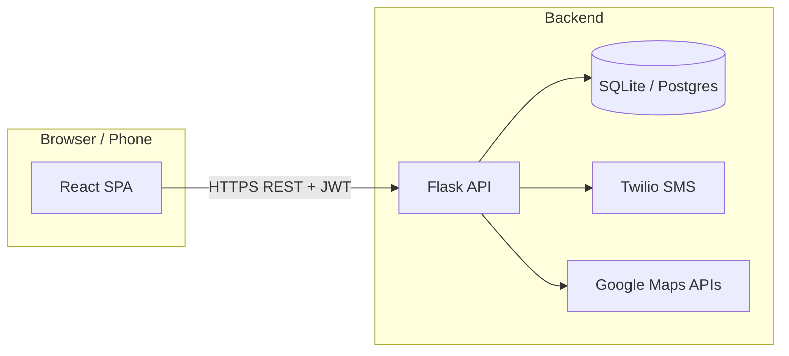

# NavSafe — Intelligent Ride-Hailing Safety Platform

**Real-time route risk scoring, live journey monitoring, and Twilio SMS alerts** for a ride-hailing–style experience. Built as a full-stack portfolio project: **React (Vite)** frontend, **Flask** REST API, **JWT** authentication, **Google Maps** routing context, and **Twilio** notifications to the rider and emergency contact.

<p align="center">
  <strong>Stack:</strong> React · Flask · SQLAlchemy · Twilio · Leaflet · scikit-learn (risk / ML artifacts)
</p>

---

## Why this project

Demonstrates **end-to-end product thinking**: pre-ride safety scoring, a **simulated live ride** with an **activity ledger**, and **Plan A SMS** aligned with ledger events—so stakeholders see a credible safety narrative on mobile or desktop after deployment.

---

## Architecture



- **Frontend:** Vite + React, Tailwind, Leaflet maps, live dashboard and journey simulator.  
- **Backend:** Flask blueprints (`/api/auth`, `/api/ride`, `/api/user`, `/api/safety`, `/api/history`), JWT-protected routes.  
- **Alerts:** Twilio sends the **same** message body to **rider** and **emergency contact** when both numbers are set and allowed by your Twilio account (see [DEPLOYMENT.md](./DEPLOYMENT.md)).

---

## Features (high level)

| Area | What it does |
|------|----------------|
| **Safe route analysis** | Search origin/destination; routes receive safety-related scoring for comparison. |
| **Live ride / demo** | Full-journey simulator drives map visuals, risk readout, and **activity ledger** entries. |
| **SMS (Twilio)** | Ride start, Plan A safety events (aligned with ledger), and ride completion—see `backend/services/sms_templates.py`. |
| **User profile** | Phone + emergency contact used for SMS delivery. |
| **History & post-ride** | Ride history and alert timelines for demos and review. |

---

## Repository layout

```
├── backend/           # Flask app (app.py), models, routes, services
├── frontend/          # Vite React app
├── .github/           # PR template for collaboration
├── DEPLOYMENT.md      # Production / demo deployment (resume-ready)
└── CONTRIBUTING.md    # How to work with a teammate
```

---

## Local development

### Prerequisites

- **Node.js** 18+ and **npm**  
- **Python** 3.9+ (virtual environment recommended)  
- **Google Maps** API key (Geocoding + Directions as used by your routes)  
- **Twilio** account (optional for SMS; app logs skips if unset)

### Backend

```bash
cd backend
python -m venv venv
source venv/bin/activate   # Windows: venv\Scripts\activate
pip install -r requirements.txt
cp .env.example .env       # fill in secrets — never commit .env
python app.py              # http://localhost:5001
```

Health check: `GET http://localhost:5001/api/health`

### Frontend

```bash
cd frontend
npm install
cp .env.example .env.local # set VITE_API_BASE_URL if API is not on localhost:5001
npm run dev                # http://localhost:5173
```

### Twilio smoke test (optional)

```bash
cd backend
./venv/bin/python scripts/test_twilio_sms.py
./venv/bin/python scripts/test_twilio_sms.py +91XXXXXXXXXX
```

---

## Environment variables

| Variable | Where | Purpose |
|----------|--------|---------|
| `VITE_API_BASE_URL` | `frontend/.env` | Backend base URL (no trailing slash). **Required in production.** |
| `JWT_SECRET_KEY` | `backend/.env` | Sign JWTs (use a long random string in production). |
| `DATABASE_URL` | `backend/.env` | Optional; defaults to SQLite under `backend/instance/`. |
| `GOOGLE_MAPS_API_KEY` | `backend/.env` | Maps / geocoding as used by the app. |
| `TWILIO_ACCOUNT_SID`, `TWILIO_AUTH_TOKEN`, `TWILIO_PHONE_NUMBER` | `backend/.env` | SMS; must be valid **34-character** Account SID. |

Copy from **`backend/.env.example`** and **`frontend/.env.example`**.

---

## Collaboration & deployment

- **Working with a teammate:** [CONTRIBUTING.md](./CONTRIBUTING.md) (branches, PRs, reviews).  
- **Shipping a public demo:** [DEPLOYMENT.md](./DEPLOYMENT.md) (recommended hosts, env vars, CORS, HTTPS).

---

## Security notes

- Never commit **`.env`** or Twilio secrets.  
- Regenerate leaked **Twilio Auth Tokens** immediately.  
- Use a strong `JWT_SECRET_KEY` and HTTPS in production.

---

## License

This project is provided for **portfolio and educational** use. Add a `LICENSE` file if you need a specific open-source license.

---

## Author

Maintained for portfolio and collaboration—see **Contributors** on GitHub after your friend joins the repo.
